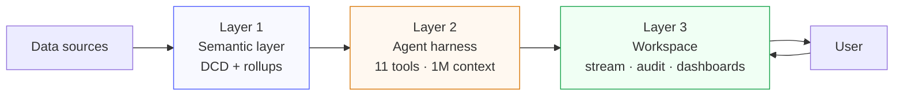
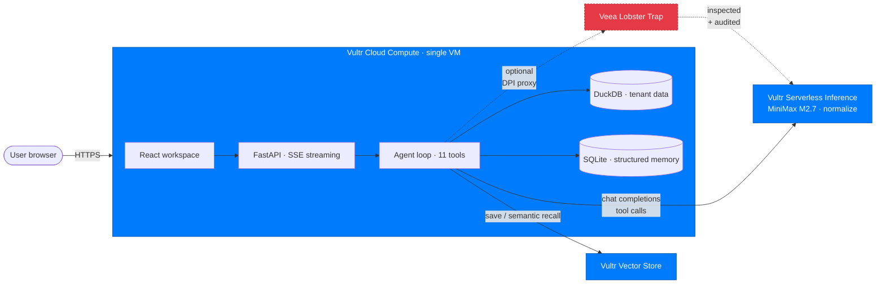

<p align="center">
  
</p>

<h1 align="center">Manthan</h1>

<p align="center">
  <b>An autonomous AI data analyst your business can actually trust — running on Vultr end-to-end.</b><br/>
  Plug in your data, ask in plain English. Every number is one click from the SQL that produced it.
</p>

<p align="center">
  <strong>Live: <a href="https://manthandemo.duckdns.org">manthandemo.duckdns.org</a></strong> · Built for the <strong>AI Agent Olympics</strong> at Milan AI Week 2026
</p>

<p align="center">
  <a href="https://www.vultr.com"></a>
  <a href="https://www.vultr.com/products/cloud-inference/"></a>
  <a href="https://api.vultrinference.com"></a>
  <a href="https://duckdb.org/"></a>
  <a href="https://fastapi.tiangolo.com/"></a>
  <a href="LICENSE"></a>
</p>

---

## Vultr deployment — submission details

This is the **AI Agent Olympics · Milan AI Week 2026** submission for the
Vultr Awards. Manthan runs end-to-end on Vultr Cloud, with the reasoning
model served by Vultr Serverless Inference and the agent's cross-session
memory stored in Vultr Vector Store.

| | |
|---|---|
| **Public demo URL** | <https://manthandemo.duckdns.org> — Let's Encrypt TLS, full app surface |
| **Raw IP (Vultr verification)** | <https://66.245.207.186> — self-signed for browser, same app on the bare Vultr IP |
| **Vultr region** | Milan, IT (`mil` — geographically closest to the on-site judges at Fiera Milano) |
| **Vultr Cloud Compute plan** | 2 vCPU / 4 GB RAM / 80 GB NVMe · Ubuntu 24.04 LTS |
| **Vultr Serverless Inference model** | `MiniMaxAI/MiniMax-M2.7-normalize` (open weights, agentic-first), Qwen3.6-27B as cascade fallback |
| **Vultr Vector Store** | Collection per dataset scope, semantic recall for the agent's `save_memory` / `recall_memory` tools |
| **Bootstrap** | One-click via [`infra/vultr/cloud-init.yaml`](infra/vultr/cloud-init.yaml) — fresh VM to running stack in ~3 minutes |
| **TLS** | Caddy + Let's Encrypt for the hostname; Caddy internal CA for the IP |
| **Source of record** | [`github.com/Miny-Labs/Manthan`](https://github.com/Miny-Labs/Manthan) (Apache 2.0) |

**Verify the deployment is on Vultr** — `dig manthandemo.duckdns.org` resolves to `66.245.207.186`; `whois 66.245.207.186` returns the Vultr Holdings / Choopa AS allocation. The same is visible by clicking the raw-IP URL above and inspecting the certificate's IP SAN.

**Five datasets pre-loaded for the demo** — Card Payments & Fraud Intelligence (CFO · 138K rows), E-Commerce Customer Behavior (CMO · 542K rows), Subscription Churn Risk (COO · 7K rows), Workforce Attrition & Talent Risk (CHRO · 1.5K rows), Developer Talent Market (CTO · 65K rows). Click any card on the live URL, ask a hard question, watch the agent loop fire end-to-end.

---

## Why Manthan

Every business has the same dashboard graveyard: a Looker license nobody uses, a Tableau cert nobody renewed, six BI tools competing for the same screen. The analyst backlog grows because *"pull me the numbers"* still takes a human a week.

Frontier LLMs can shorten that to seconds — when handed a clean question and a real toolset. The reason *"talk to your data"* products keep failing in production isn't the model. It's the harness. Hand any model a raw schema and it caps around 30% accuracy on real enterprise questions, because no model knows what "revenue" or "active customer" means in *your* business. The wrong answer comes back fluent and confident, and nobody catches it until two dashboards disagree in a board meeting.

Manthan is the harness. Three layers, all engineered to make AI answers deterministic, governed, and auditable — so an analyst can ship them and a CFO can sign them.

---

## How it works



### Layer 1 · Semantic layer

A typed contract per dataset, called the **Data Context Document (DCD)**. YAML on disk, versioned, human-editable.

- **Entities** are stable business handles over physical tables. Re-ingest a dataset; the entity slug survives, the physical pointer rotates.
- **Metrics** are governed definitions: `revenue = SUM(subtotal) WHERE status='delivered'`. The filter is always applied. Aggregation semantics (additive, ratio, non-additive) declared.
- **Rollups** are pre-materialized cuts (by region, by day) so common questions never scan the full table.

When the column profiler is under-confident on anything important, the ingest pipeline **stops and asks**. Your answer is baked into the DCD. The agent reads the contract before every query.

### Layer 2 · Agent harness

A single async while-loop. The agent reasons, picks a tool, observes the result, decides whether to continue. The whole DCD, prior memories, and tool definitions fit in one prompt — no chunking, no retrieval gymnastics — because the upstream reasoning model carries a 1M context window.

Eleven tools, picked by question shape:

| Tool | When |
|---|---|
| `get_schema` / `get_context` | Default first move on any new turn |
| `compute_metric` | Question names a governed metric (`revenue`, `churn`) |
| `run_sql` | Ad-hoc slice not covered by a metric |
| `run_python` | Forecast, cluster, regression. Stateful sandbox with pandas, sklearn, statsmodels, scipy |
| `ask_user` | Genuinely ambiguous question. Blocks the turn, renders a clarification card |
| `create_plan` | Task needs 3+ tool calls. Surfaces a plan with DCD citations, waits for approval |
| `save_memory` / `recall_memory` | Cross-session findings — writes go to both SQLite (structured) and Vultr Vector Store (semantic) |
| `emit_visual` | Inline chart in the conversation |
| `create_artifact` | Sandboxed HTML dashboard in the side panel |

**Three guarantees the model alone can't make:**

- **Pre-execution SQL validator.** Every query the agent writes is parsed by sqlglot against the DCD catalog *before* DuckDB sees it. Hallucinated tables and metric-filter violations are caught at parse time with a repair hint.
- **Ground-truth rule.** Every specific number cited in prose has to come from a tool call run *this turn*. Cited numbers without a tool? The loop nudges once, retries with a forcing message.
- **Self-healing artifacts.** Generated dashboards run through `node --check` before they ship. Broken syntax triggers a one-shot repair pass. Runtime errors in the iframe surface as a "Retry query" button.

### Layer 3 · Workspace

Streaming SSE, not chunked HTTP. A jitter buffer (`SmoothText`) reveals tokens at human reading pace regardless of how bursty the upstream stream is.

Every numeric value in the answer is **click-to-audit**. A drawer slides in and streams an auditor-grade sentence:

> *"This is the Revenue metric (governed slug `revenue`) from the Orders entity. Per the contract, it sums delivered-order subtotals where `status = 'delivered'`. For this answer it was further filtered to `State = 'California'`. Calculated from 4,820 of 12,300 rows from the Orders dataset, ingested 14 May 2026."*

Behind every cited number sits a structured lineage event with metric slug, filters, SQL, row count, dataset id. The drawer reads that structure and re-narrates it in plain English; if the narration drifts, a regex fallback rebuilds the sentence from the lineage.

---

## Built on Vultr, end to end

Manthan is engineered to run on Vultr Cloud. Every layer of the stack uses a managed Vultr surface:

| Layer | Vultr surface | What it does |
|---|---|---|
| **Reasoning** | **Vultr Serverless Inference** | Hosts the agent's upstream LLM (`MiniMaxAI/MiniMax-M2.7-normalize` by default, with `Qwen/Qwen3.6-27B-FP8` as the cheap-and-fast fallback model in the cascade). Reached through the OpenAI-compatible chat completions endpoint at `https://api.vultrinference.com/v1`, so the same OpenAI SDK shape (messages + tools + tool_calls) flows through unchanged. |
| **Memory** | **Vultr Vector Store** | Every memory the agent saves is mirrored into a Vultr Vector Store collection (one per dataset / user scope). When the agent later recalls — *"what did we say about revenue?"* — semantic search hits the Vector Store first, then falls back to the SQLite keyword index. The two backends are queried in parallel; results are deduped by key. |
| **Compute** | **Vultr Cloud Compute** | The whole stack runs on one Vultr VM. Bootstrap is one-click via `infra/vultr/cloud-init.yaml` or `setup.sh`. The hackathon's $200 Vultr credit covers ~3 months on the smallest plan; a real deployment scales with the VM, not the architecture. |
| **Security (optional)** | **Veea Lobster Trap** (MIT) | A deep prompt-inspection proxy that sits between the agent and Vultr Inference, blocks prompt injection / data exfiltration / credential leaks, and writes an auditor-grade JSONL log of every prompt and response. |

The architectural point: **the reasoning, the memory, and the compute are all one provider away.** No vendor-lock minefield to clear before a Manthan deployment can talk to its model and remember a session across restarts.

### Topology



Three Vultr surfaces, one optional security ribbon. Every dotted line is an
inspectable hop — Lobster Trap writes a JSONL audit log of every prompt and
response, so a regulator can read the trail and an engineer can fork the policy.

### Verified end to end

Smoke-tested against the [DABstep](https://huggingface.co/datasets/adyen/DABstep)
benchmark dataset (Adyen / HuggingFace — 138K real-Stripe-like payments,
designed for agentic data-analysis evaluation). MiniMax M2.7 via Vultr Inference
drove the full agent loop: multi-step SQL with the sqlglot validator catching
table-name mistakes and the agent self-correcting, statistical analysis through
`run_python`, executive dashboards via `create_artifact`. Vector Store semantic
recall returns the right memory as the top hit for paraphrased queries.

---

## Production security · Lobster Trap

Manthan ships with an opt-in security proxy from [Veea's Lobster Trap](https://github.com/veeainc/lobstertrap) (MIT). Every prompt the agent sends to Vultr Inference, and every response the model returns, is inspected by deep prompt inspection and policy-checked before forwarding.

```
Manthan agent ──▶ http://localhost:8080  ──▶  api.vultrinference.com
                  (Lobster Trap proxy        (Vultr Serverless
                   inspects prompts +         Inference — OpenAI
                   responses, enforces        compat /chat/completions
                   YAML policy, audits        and /vector_store)
                   to JSONL)
```

The bundled policy at `infra/lobstertrap/manthan-policy.yaml` blocks prompt injection, data exfiltration, obfuscation, and credential leaks in responses, while logging every analytical query for the audit drawer. To enable it locally:

```bash
# 1. Build Lobster Trap (one time)
git clone https://github.com/veeainc/lobstertrap.git ../lobstertrap
cd ../lobstertrap && make build

# 2. Start the proxy
cd ../Manthan && ./infra/lobstertrap/start.sh

# 3. Point Manthan at the proxy in .env
VULTR_BASE_URL=http://localhost:8080/v1
AGENT_VULTR_BASE_URL=http://localhost:8080/v1

# 4. Tail the audit log during a demo
tail -f infra/lobstertrap/audit.log | jq .
```

Every upstream LLM call is policy-checked at parse time and audited to disk. A regulator can read the log; an engineer can fork the policy.

---

## Getting started

> **First time?** A live instance runs at **[manthandemo.duckdns.org](https://manthandemo.duckdns.org)** — pre-loaded with five enterprise datasets (payments, e-commerce, churn, HR, developer-talent). Click any card, ask a hard question.

### Prerequisites

- A Vultr account with Serverless Inference enabled — [my.vultr.com/inference/](https://my.vultr.com/inference/)
- Python **3.12+** and Node **20+** for local development
- Hackathon participants: the $200 Vultr credit covers everything for the build window

### With Docker (recommended)

```bash
git clone https://github.com/Miny-Labs/Manthan.git
cd Manthan
cp .env.example .env                # paste your VULTR_API_KEY
docker compose up --build
```

Open `http://localhost:8000`. The Docker build compiles the React bundle and serves it from FastAPI on a single port.

### Local dev (hot reload)

```bash
# backend
python -m venv .venv && source .venv/bin/activate
pip install -e ".[dev]"
uvicorn src.main:app --reload          # :8000

# frontend (new terminal)
cd manthan-ui && npm install && npm run dev   # :5173
```

### Deploy to a Vultr VM

One-click and manual paths are documented in [`infra/vultr/README.md`](infra/vultr/README.md). The short version:

```bash
# On the VM (Ubuntu 24.04)
curl -fsSL https://raw.githubusercontent.com/Miny-Labs/Manthan/main/infra/vultr/setup.sh | bash
# then paste VULTR_API_KEY into /opt/manthan/.env and restart compose
```

For the Coolify path (the hackathon-recommended deploy flow), see `infra/vultr/README.md` § C.

### Five minutes, end to end

1. **Upload** in the sidebar. Drop any CSV.
2. The processing wizard walks through six stages. When it pauses, answer the ambiguous columns.
3. From the dataset profile, click **Start analyzing**.
4. Ask something. Watch the thinking, tool calls, and narrative stream live.
5. Click any number in the answer. The audit drawer opens and streams its provenance.

---

## Configuration

All config via `.env`. Minimum to run:

```env
VULTR_API_KEY=<vultr-inference-key>
VULTR_MODEL=MiniMaxAI/MiniMax-M2.7-normalize
DATA_DIRECTORY=./data
```

Optional: cascade fallback model, DuckDB tuning, vault master key, log format. See `.env.example`.

### Testing

```bash
pytest tests/ -q
```

### Linting

```bash
ruff format src/ tests/ && ruff check src/ tests/
cd manthan-ui && npm run typecheck && npm run lint
```

---

## API surface

`/docs` serves the full OpenAPI spec. Key endpoints:

| Path | Purpose |
|---|---|
| `POST /datasets/upload` · `upload-multi` | Single file or bundle ingest |
| `POST /datasets/connect` · `connect-url` | Database or cloud-URL ingest |
| `POST /datasets/{id}/refresh` | Re-ingest preserving user edits |
| `GET /datasets/{id}/schema` · `context` | Dataset listing and DCD access |
| `POST /agent/query` | **SSE** — the agent loop |
| `POST /audit/describe-claim` | **SSE** — the audit drawer stream |
| `POST /memory` | Dual-write: SQLite + Vultr Vector Store |
| `GET /memory/search/` | Semantic-first recall (Vultr Vector Store → SQLite) |
| `POST /ask_user/{qid}/answer` | Submit a clarification answer |
| `POST /plans/{pid}/approve` | Approve a proposed plan |

---

## Supported sources

| Tab | Status | Covers |
|---|---|---|
| Files | ✅ | CSV, TSV, Parquet, Excel, JSON, multi-file bundles with auto-detected FKs |
| Cloud URL | ✅ | `https://`, `s3://`, `gs://`, `az://` (saved encrypted credentials) |
| Database | ✅ | Postgres, MySQL, SQLite via DuckDB read-only attach |
| SaaS | UI ready | Stripe, HubSpot, Salesforce, Shopify, Notion, Airtable, Google Ads, Meta, GitHub, Slack — `dlt` connectors land next |

---

## Repo layout

```
Manthan/
├── src/                # Python backend
│   ├── agent/          # Loop, tools, prompt, events, artifact repair
│   ├── api/            # FastAPI routers (incl. dual-backed memory)
│   ├── semantic/       # DCD schema, generator, validator, history
│   ├── ingestion/      # Loaders for files, URLs, databases
│   ├── profiling/      # AI classifier + heuristic fallback
│   ├── materialization/ # Rollups + verified queries
│   ├── tools/          # Backing fns for compute_metric, run_sql, run_python
│   ├── sandbox/        # Python subprocess REPL
│   └── core/           # Config, state, LLM client, Vector Store memory, credentials vault
├── manthan-ui/         # React 19 + Vite + TypeScript workspace
├── infra/
│   ├── vultr/          # Cloud-init + setup.sh + Coolify guide
│   └── lobstertrap/    # Optional Veea DPI security proxy
├── tests/              # pytest test suite
├── Dockerfile · docker-compose.yml
└── .env.example
```

---

## License

[Apache 2.0](LICENSE). Fork it, change it, embed it, ship it commercially. Only ask is you keep the attribution.

---

<p align="center">
  <a href="https://github.com/Miny-Labs/Manthan">github.com/Miny-Labs/Manthan</a><br/>
  Built by <a href="https://github.com/hitakshiA">Hitakshi Arora</a> at <a href="https://github.com/Miny-Labs">Miny Labs</a> for the AI Agent Olympics at Milan AI Week 2026.
</p>
